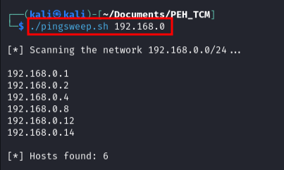

<!DOCTYPE html>
<html>
<head>
    <h1>Ping Sweep script in Bash</h1>
</head>
<body>
    
A ping sweep or ICMP sweep is a basic network scanning technique, used to map a network’s IP addresses to live hosts (To discover available computers). This is useful in cybersecurity for many reasons, as I will mention.</h2>
  <h5>Offensive Perspective - Pentesting/ReadTeam</h5>
    
You can use an ICMP sweep, along with other techniques such as ARP scanning, to discover the hosts of a network you are auditing. These are going to be the future targets you might want to attack as a pentester, expanding the attack surface for possible vulnerabilities.

  <h5>Defensive Perspective - SOC/NOC</h5>
    
As a network administrator you can block ICMP echo requests from outside sources, this gives you the possibility to detect an unrecognized device in the network that can be malicious, and ensure the devices are working correctly.

    

  
<h2>How it works</h2>

  
A ping sweeper is actually not a complex tool, is based on the ICMP echo request which we can do with the bash command

<code>ping [ip_address]</code>, if the target IP address allows ping requests it will respond with a message similar to the image below:

<code>64 bytes from [ip_address] [flags]</code>, this can be later filtered with a Bash command.

    
  
If the network is a /24 network, this means we have 256 possible possible IP addresses, ranging from xxx.xxx.xxx.0 to xxx.xxx.xxx.255, but not all these are actually useful addresses, we have to consider that the first is used for the network address, and the last is used for broadcasting, these are not usually valid targets, so we are left with 254 addresses to ping. So all we have to do is iterate through the range xxx.xxx.xxx.1 to xxx.xxx.xxx.254 and send a ICMP echo request to each of them, luckily for us this is an easy task for a computer since each ping request usually takes the order of milliseconds.

    <h2>Scipt Review</h2>
    <h3>Input validation</h3>
    
    
I start this code with the shebang <code>#!/bin/bash</code>, which tells the operating system the script’s interpreter, in this case Bash. This is followed by the actual code, starting with a simple <strong>if statement</strong> input validation, checking if the user has provided an argument, <code>$1</code>, when running the script. If not, it prints an error message and the correct syntax for running the script.

    <h3>Variables</h3>
    
    
If an argument is provided, the script continues. It creates a temporary file, named <code>results_temp</code>, to store the results of the ping commands, this si done with the <code>mktemp</code> utility. Temporal files are usefull in this context, as large amounts of text can be stored temporarily inside them. After that assigns the first argument, passed as a parameter from the terminal (<code>$1</code>), to the variable mask, as this should be the network portion of the <b>/24</b> address known as <b>Subnet Mask</b>.

    <h3>Iterate through the network</h3>
        
    
This section starts a loop that pings each IP address in the network. This is a <code>for</code> loop, that creates a temporary variable <code>ip</code> to store the values of the <b>host portion</b> for the addresses we are going to ping, each iteration increments the value of <code>ip</code> by 1 unit, from 1 to 254. The <code>&</code> at the end of the ping command sends the process to the background, allowing the script to ping multiple addresses simultaneously. Lastly, sleeps the scripts for 0.02 seconds, this is to reduce the number requests processed at a time, and not overwhelm the CPU.

    <h3>Output filtering</h3>
    
    
Basically, the firt line filters the results to only include successful pings, with <code>grep</code>, extracts the IP addresses, with <code>awk</code>, removes the trailing colon, with <code>tr</code> and sorts the addresses, with <code>sort</code>. The result is that it extracts the IP addresses that responded the ping request and then prints them to the terminal. The following two lines, simply count the number of successful pings and print the result.

    <h3>Cleaning</h3>
    
    
Finally, the script removes the temporary file it created to store the results. This is good practice as it prevents the script from leaving unnecessary files on your system. The <code>fi</code> at the end closes the <code>if</code> statement.

    <h3>Summary</h3>
    
This project helped me putting into practice my bash scripting and networking knowledge, and is, actually, very usefull, I personally use it very often when solving vulnerable boxes to perfom host discovery, in addition to other tools. though I am happy with the result it stills has room for improvements, for example you can add a filter to also extract the TTL from the request, this is a usefull numberas, since you can estimate the Operating System of the host you send the ping request.

    

    <h2>Script</h2>
    
The output of the script looks like the following:

    
    
While the error message is:

    
</body>
</html>
